# WARNING: This repository is no longer maintained :warning:

> This repository will not be updated. I will check periodically for pull requests, but do not expect a quick response. 

# Create a fair evoting application to ensure correct election results with Hyperledger Fabric and IBM Blockchain Platform

> **NOTE**: This developer pattern creates a blockchain network on *IBM Blockchain Platform version **2.5*** using the *Hyperledger Fabric version **1.4***.

<br>
<p align="center">
  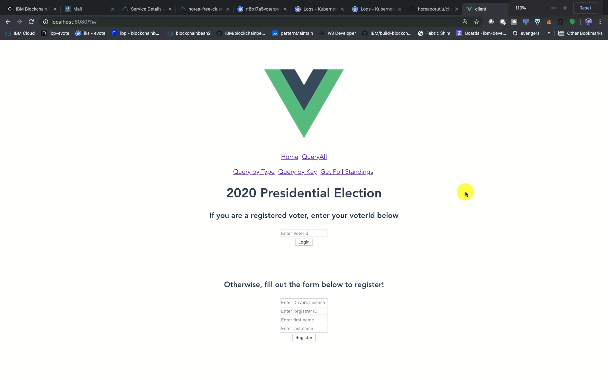
</p>
<br>

Have you ever wondered how exactly the votes in a presidential election 
counted? What if instead of having volunteers that are spending hours a 
day counting votes manually, we have an app that was backed by blockchain, 
recording each vote made by a voter, ensuring double-voting is not possible?
That's what this code pattern explains how to do. We aim to build a web-app
in which the voter can register with their drivers license, get a unique 
voterId which is used to login to the app, and cast the vote. The vote is 
tallied on the blockchain, and the web-app shows the current standings of the
polls. 

### Voting using Public Key Infrastructure
At the start of the application, the user registers to vote by providing their drivers license number,
registrar district, and first and last name. In this step, we can check to see if the drivers license 
is valid, and has not been registered previously. If all goes well, we create a private and public key 
for the voter with our certificate authority that is running on the cloud, and add those keys to the 
wallet. To read more about public key infrastructure, and how Hyperledger Fabric implements identity
using this technology, go [here](https://hyperledger-fabric.readthedocs.io/en/release-1.4/identity/identity.html).

After that, we use our drivers license number to submit our vote, during which the application checks 
if this drivers license number has voted before and tells the user they have already submitted a vote 
if so. If all goes well, the political party which the voter has chosen is given a vote, and the world
state is updated. The application then updates our current standings of the election to show how many 
votes each political party currently has. 

Since each transaction that is submitted to the ordering service must have a signature from a valid
public-private key pair, we can trace back each transaction to a registered voter of the application, 
in the case of an audit.

In conclusion, although this is a simple application, the developer can see how they can implement a 
Hyperledger Fabric web-app to decrease the chance of election-meddling, and enhance a voting application
by using blockchain technology. 

When the reader has completed this code pattern, they will understand how to:

* Create, build, and use the IBM Blockchain Platform service.
* Build a blockchain back-end using Hyperledger Fabric API's
* Create and use a (free) Kubernetes Cluster to deploy and monitor our 
Hyperledger Fabric nodes.
* Deploy a Node.js app that will interact with our deployed smart contract.

# Flow Diagram
<br>
<p align="center">
  
</p>
<br>

# Flow Description
1. The blockchain operator sets up the IBM Blockchain Platform 2.5 service.
2. The IBM Blockchain Platform 2.5 creates a Hyperledger Fabric network on an IBM Kubernetes 
Service, and the operator installs and instantiates the smart contract on the network.
3. The Node.js application server uses the Fabric SDK to interact with the deployed network on IBM Blockchain Platform 2.5 and creates APIs for a web client.
4. The Vue.js client uses the Node.js application API to interact with the network.
5. The user interacts with the Vue.js web interface to cast their ballot and
and query the world state to see current poll standings.

# Included components
*	[IBM Blockchain Platform](https://console.bluemix.net/docs/services/blockchain/howto/ibp-v2-deploy-iks.html#ibp-v2-deploy-iks) gives you total control of your blockchain network with a user interface that can simplify and accelerate your journey to deploy and manage blockchain components on the IBM Cloud Kubernetes Service.
*	[IBM Cloud Kubernetes Service](https://www.ibm.com/cloud/container-service) creates a cluster of compute hosts and deploys highly available containers. A Kubernetes cluster lets you securely manage the resources that you need to quickly deploy, update, and scale applications.
* [IBM Blockchain Platform Extension for VS Code](https://marketplace.visualstudio.com/items?itemName=IBMBlockchain.ibm-blockchain-platform) is designed to assist users in developing, testing, and deploying smart contracts -- including connecting to Hyperledger Fabric environments.

## Featured technologies
+ [Hyperledger Fabric v1.4](https://hyperledger-fabric.readthedocs.io) is a platform for distributed ledger solutions, underpinned by a modular architecture that delivers high degrees of confidentiality, resiliency, flexibility, and scalability.
+ [Node.js](https://nodejs.org) is an open source, cross-platform JavaScript run-time environment that executes server-side JavaScript code.
+ [Vue.js 2.6.10](https://vuejs.org/) Vue.js is an open-source JavaScript framework for building user interfaces and single-page applications.

# Watch the Video - Intro (Cloud)

[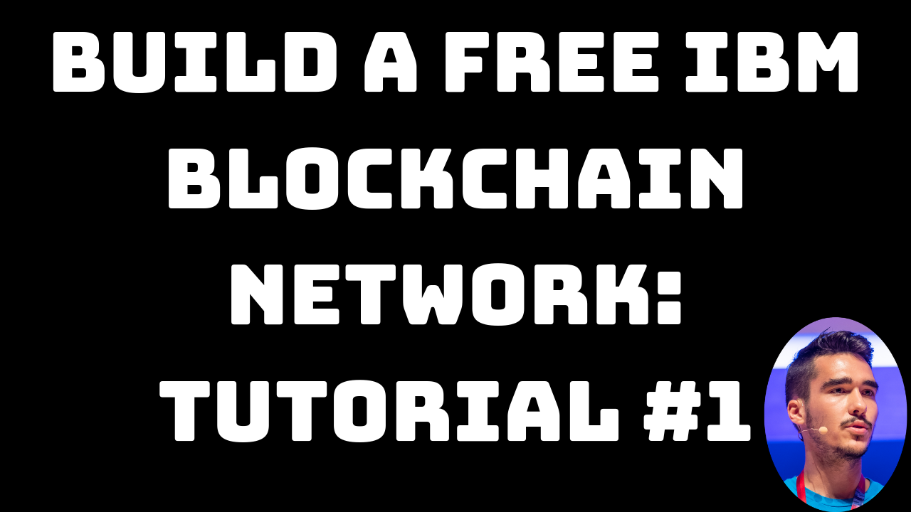](https://www.youtube.com/watch?v=ny8iif6ZXRU)

# Watch the Video - Build and Run the App (Cloud)

[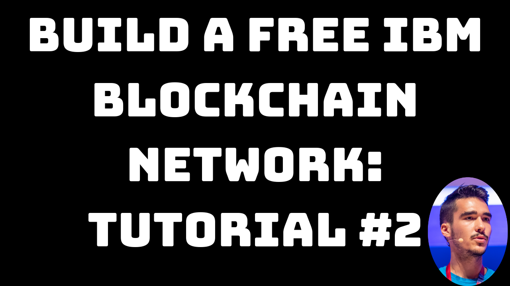](https://www.youtube.com/watch?v=mkVUW1KroTI)

# Watch the Video - Code walkthrough (User Authentication)

[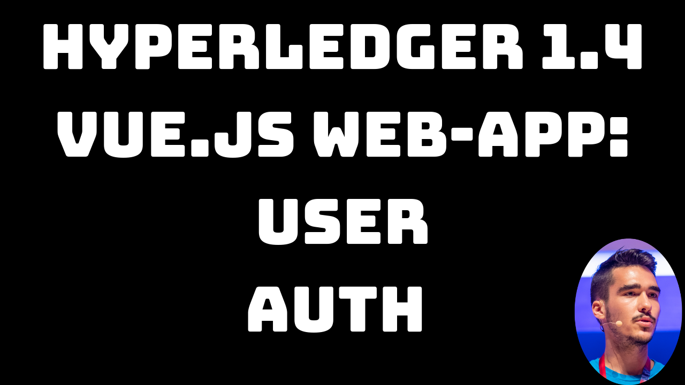](https://www.youtube.com/watch?v=8uJSHW3Rpzs)

# Watch the Video - Code walkthrough (Routes)

[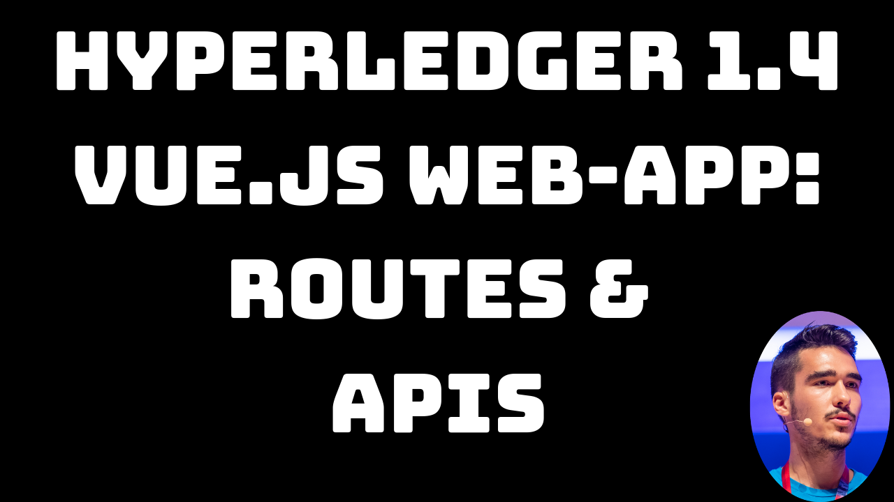](https://www.youtube.com/watch?v=iajsJiIC7oU)

## Prerequisites (Cloud)

This Cloud pattern assumes you have an **IBM Cloud account**.
  - [IBM Cloud account](https://tinyurl.com/y4mzxow5)
  - [Node v8.x or greater and npm v5.x or greater](https://nodejs.org/en/download/)

You do not technically need VSCode or the IBM Blockchain Platform extension for VSCode if you are running the 
Cloud pattern, but if you want to make any changes to the smart contract, you will need the
extension to package your smart contract project. 


## Prerequisites (Local)
If you want to run this pattern locally, without any Cloud services, then all you need is VSCode and the
IBM Blockchain Platform extension. 
- [Install VSCode version 1.39](https://code.visualstudio.com/updates/v1_39)
- [Install IBM Blockchain Platform Extension for VSCode](https://github.com/IBM-Blockchain/blockchain-vscode-extension)
- [Node v8.9.0](https://nodejs.org/en/download/)
- [npm v6.11.3](https://nodejs.org/en/download/)

**🚧🚧Note: you will need Node 8.x to run this pattern!🚧🚧**

For example, to install and run Node 8.9.0: 

```bash
  brew install nvm
  nvm install 8.9.0
  nvm use 8.9.0
```  


# Steps (Local Deployment)
> To run a local network, you can find steps [here](./docs/run-local.md).

# Steps (Cloud Deployment)
1. [Clone the Repo](#step-1-clone-the-repo)
2. [Create IBM Cloud services](#step-2-create-ibm-cloud-services)
3. [Build a network](#step-3-build-a-network)
4. [Deploy voterContract Smart Contract on the network](#step-4-deploy-voterContract-smart-contract-on-the-network)
5. [Connect application to the network](#step-5-connect-application-to-the-network)
6. [Run the application](#step-6-run-the-application)

## Step 1. Clone the Repo

Git clone this repo onto your computer in the destination of your choice, then go into the web-app folder:
```
HoreaPorutiu$ git clone https://github.com/IBM/evote
```

## Step 2. Create IBM Cloud services

* Create the [IBM Cloud Kubernetes Service](https://cloud.ibm.com/catalog/infrastructure/containers-kubernetes).  You can find the service in the `Catalog`.  For this code pattern, we can use the `Free` cluster, and give it a name.  Note, that the IBM Cloud allows one instance of a free cluster and expires after 30 days. <b>The cluster takes around 20
minutes to provision, so please be patient!</b>

<br>
<p align="center">
  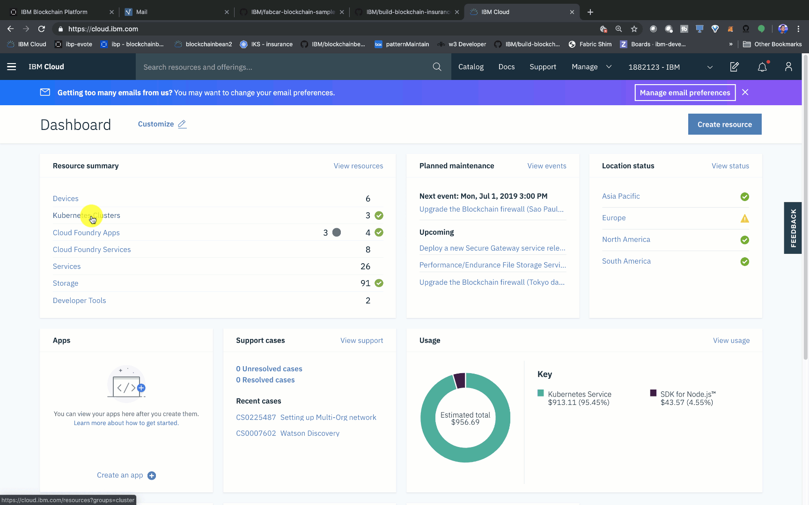
</p>
<br>

* Create the [IBM Blockchain Platform](https://console.bluemix.net/catalog/services/blockchain/) service on the IBM Cloud.  You can find the service in the `Catalog`, and give a name.

* After your Kubernetes cluster is up and running, you can deploy your IBM Blockchain Platform service on the cluster. The service walks through few steps and finds your cluster on the IBM Cloud to deploy the service on.

* In the gif below, you can see me choosing my free cluster to deploy my IBM Blockchain Platform.

* Once the Blockchain Platform is deployed on the Kubernetes cluster (which can 
take a couple of minutes, you can launch the console to start operating on your
blockchain network by clicking on *Launch the IBM Blockchain Platform*.

<br>
<p align="center">
  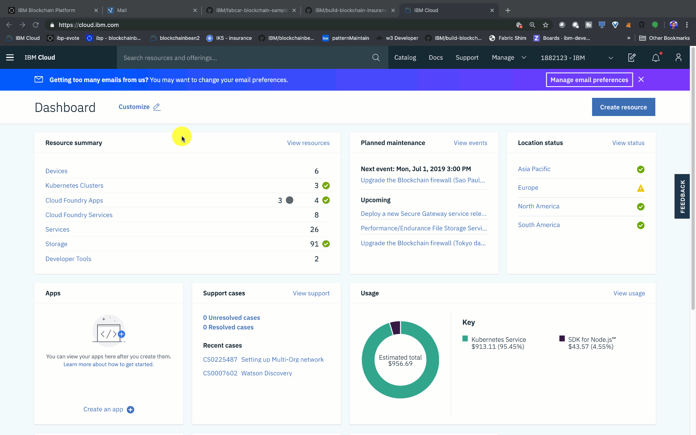
</p>
<br>


## Step 3. Build a network

We will build a network as provided by the IBM Blockchain Platform [documentation](https://cloud.ibm.com/docs/services/blockchain/howto?topic=blockchain-ibp-console-build-network#ibp-console-build-network). This will include creating a channel with a single peer organization with its own MSP and CA (Certificate Authority), and an orderer organization with its own MSP and CA. We will create the respective identities to deploy peers and operate nodes.


### Create your organization and your entry point to your blockchain

* #### Create your Voter Organization CA
  - Navigate to the <b>Nodes</b> tab in the left navigation and click <b>Add Certificate Authority +</b>.
  - Click <b>Create a Certificate Authority +</b> and click <b>Next</b>.
  - Give it a <b>CA display name</b> of `Voter CA`, a <b>CA administrator enroll ID</b> of `admin` and a <b>CA administrator enroll secret</b> of `adminpw`, then click <b>Next</b>.
  - Review the summary and click <b>Add Certificate Authority</b>.

<br>
<p align="center">
  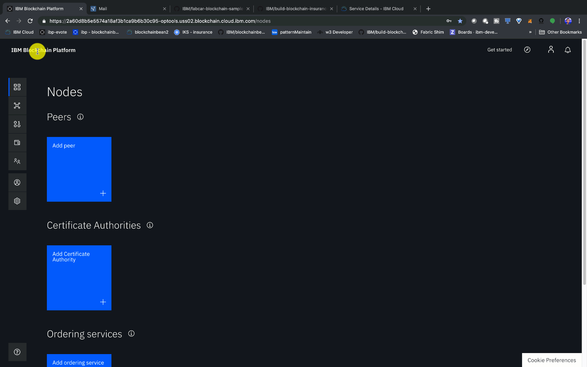
</p>
<br>


* #### Associate the voter organization CA admin identity
  - In the Nodes tab, select the <b>Voter CA</b> once it is running (indicated by the green box in the tile).
  - Click <b>Associate identity</b> on the CA overview panel.
  - On the side panel, select the <b>Enroll ID</b> tab. 
  - Provide an <b>Enroll ID</b> of `admin` and an <b>Enroll secret</b> of `adminpw`. Use the default value of `Voter CA Admin` for the <b>Identity display name</b>.
  - Click <b>Associate identity</b> to add the identity into your wallet and associate the admin identity with the <b>Voter CA</b>.

<br>
<p align="center">
  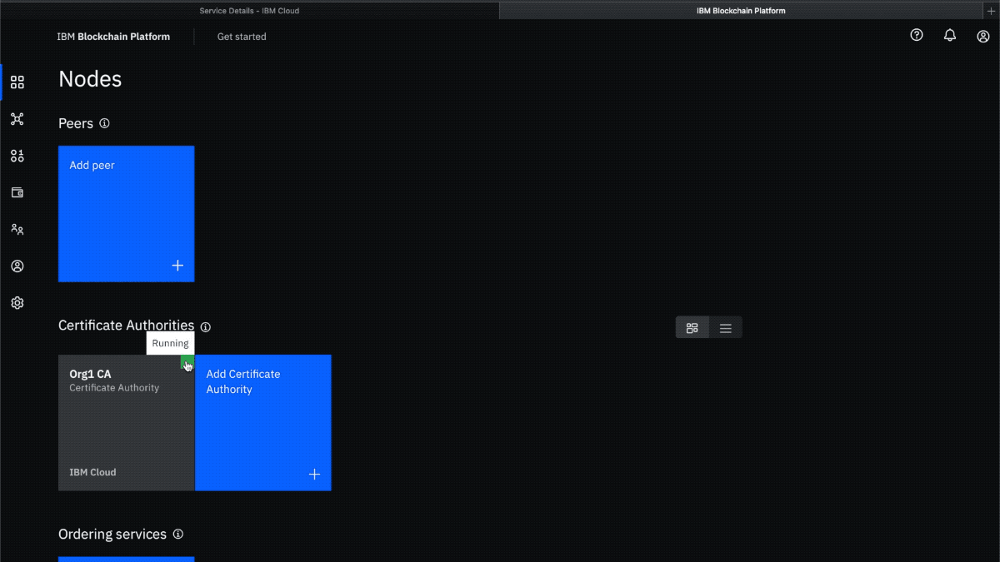
</p>
<br>


* #### Use your CA to register identities
  - Select the <b>Voter CA</b> Certificate Authority and ensure the `admin` identity that was created for the CA is visible in the table.
  - The next step is to register an admin for the organization "Voter". Click on the <b>Register User +</b> button. Give an <b>Enroll ID</b> of `voterAdmin` and an <b>Enroll secret</b> of `voterAdminpw`. Set the <b>Type</b> for this identity as `admin`. Specify to <b>Use root affiliation</b>. Leave the <b>Maximum enrollments</b> field blank. Click <b>Next</b>.
  - Skip the section to add attributes to this user and click <b>Register user</b>.
  - Repeat the process to create an identity of the peer. Click on the <b>Register User +</b> button. Give an <b>Enroll ID</b> of `peer1` and an <b>Enroll secret</b> of `peer1pw`. Set the <b>Type</b> for this identity as `peer`. Specify to <b>Use root affiliation</b>. Leave the <b>Maximum enrollments</b> field blank. Click <b>Next</b>.
  - Skip the section to add attributes to this user and click <b>Register user</b>.

<br>
<p align="center">
  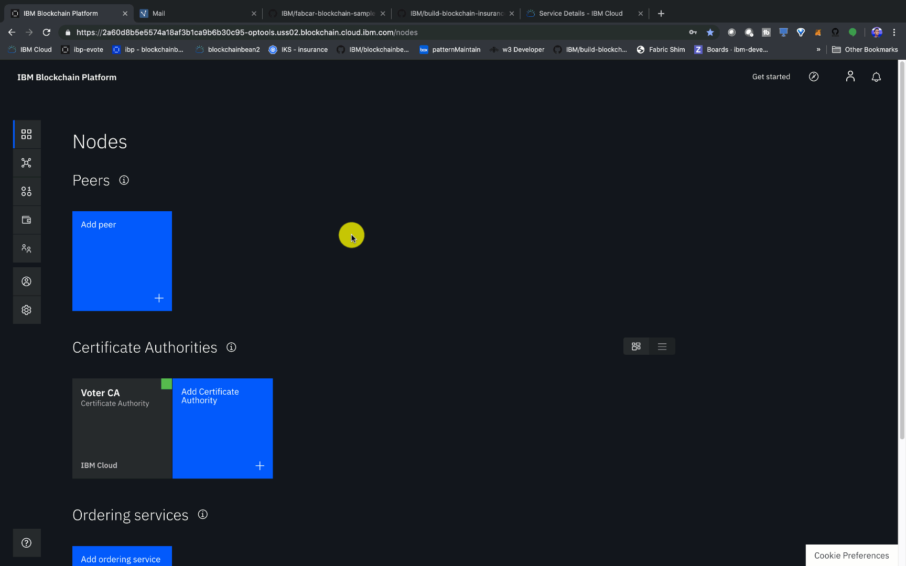
</p>
<br>


* #### Create the peer organization MSP definition
  - Navigate to the <b>Organizations</b> tab in the left navigation and click <b>Create MSP definition +</b>.
  - Enter the <b>MSP display name</b> as `Voter MSP` and the <b>MSP ID</b> as `votermsp`. Click <b>Next</b>.
  - Specify `Voter CA` as the <b>Root Certificate Authority</b>. Click <b>Next</b>.
  - Select the <b>New identity</b> tab. Give the <b>Enroll ID</b> and <b>Enroll secret</b> for your organization admin, i.e. `voterAdmin` and `voterAdminpw` respectively. Then, give the <b>Identity name</b> as `Voter Admin`.
  - Click the <b>Generate</b> button to enroll this identity as the admin of your organization and add the identity to the wallet. Click <b>Export</b> to export the admin certificates to your file system. Click <b>Next</b>.
  - Review all the information and click <b>Create MSP definition</b>.

<br>
<p align="center">
  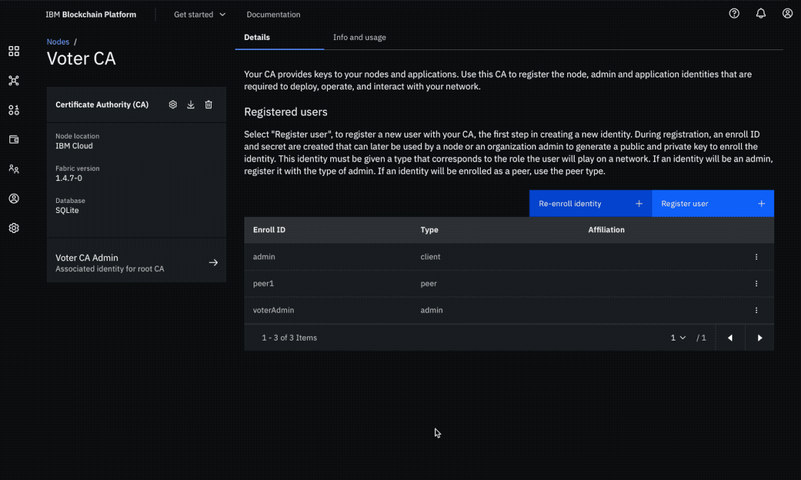
</p>
<br>


* #### Create a peer
  - Navigate to the <b>Nodes</b> tab in the left navigation and click <b>Add peer +</b>.
  - Click <b>Create a peer +</b> and then click <b>Next</b>.
  - Give the <b>Peer display name</b> as `Voter Peer` and click <b>Next</b>.
  - On the next screen, select `Voter CA` as the <b>Certificate Authority</b>. Then, give the <b>Peer enroll ID</b> and <b>Peer enroll secret</b> as `peer1` and `peer1pw` respectively. Select the <b>Organization MSP</b> as `Voter MSP`. Leave the <b>TLS CSR hostname</b> blank and select `1.4.7-0` in the drop-down for <b>Fabric version</b>. Click <b>Next</b>.
  - Provide `Voter Admin` as the <b>Peer administrator identity</b> and click <b>Next</b>.
  - Review the summary and click <b>Add peer</b>.

<br>
<p align="center">
  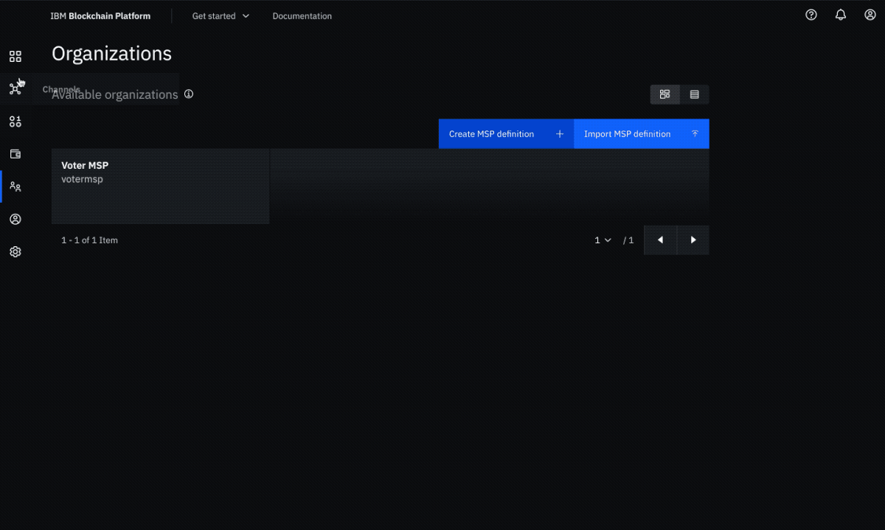
</p>
<br>


### Create the node that orders transactions

* #### Create your orderer organization CA
  - Navigate to the <b>Nodes</b> tab in the left navigation and click <b>Add Certificate Authority +</b>.
  - Click <b>Create a Certificate Authority +</b> and click <b>Next</b>.
  - Give it a <b>CA display name</b> of `Orderer CA`, a <b>CA administrator enroll ID</b> of `admin` and a <b>CA administrator enroll secret</b> of `adminpw`, then click <b>Next</b>.
  - Review the summary and click <b>Add Certificate Authority</b>.

<br>
<p align="center">
  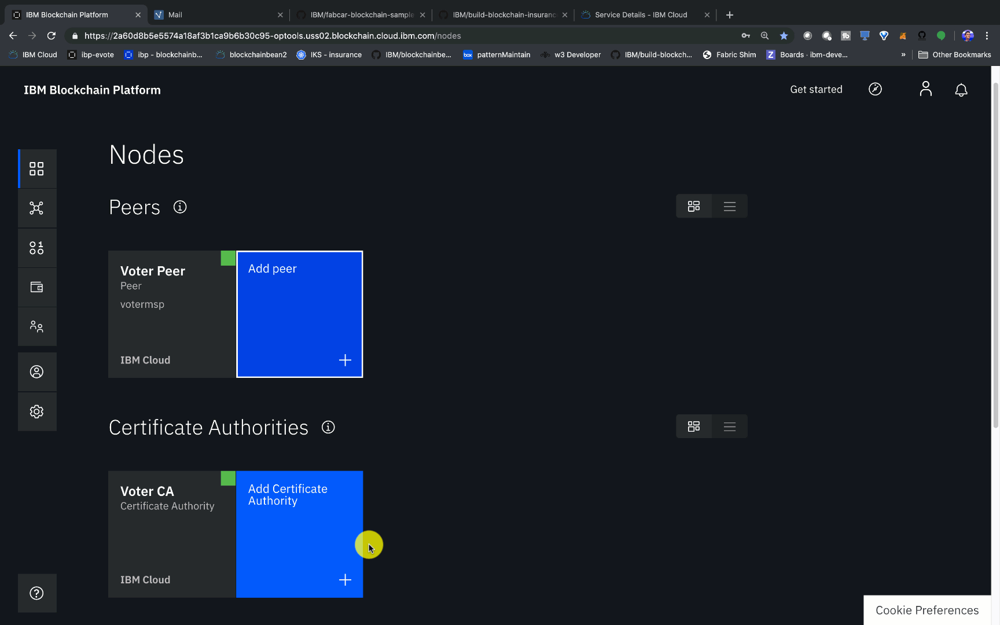
</p>
<br>

* #### Associate the orderer organization CA admin identity
  - In the Nodes tab, select the <b>Orderer CA</b> once it is running (indicated by the green box in the tile).
  - Click <b>Associate identity</b> on the CA overview panel.
  - On the side panel, select the <b>Enroll ID</b> tab. 
  - Provide an <b>Enroll ID</b> of `admin` and an <b>Enroll secret</b> of `adminpw`. Use the default value of `Orderer CA Admin` for the <b>Identity display name</b>.
  - Click <b>Associate identity</b> to add the identity into your wallet and associate the admin identity with the <b>Orderer CA</b>.

<br>
<p align="center">
  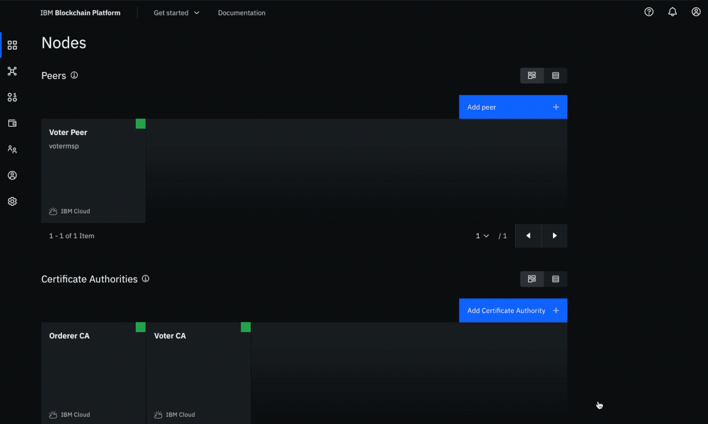
</p>
<br>


* #### Use your CA to register orderer and orderer admin identities
  - Select the <b>Orderer CA</b> Certificate Authority and ensure the `admin` identity that was created for the CA is visible in the table.
  - The next step is to register an admin for the organization "Orderer". Click on the <b>Register User +</b> button. Give an <b>Enroll ID</b> of `ordererAdmin` and an <b>Enroll secret</b> of `ordererAdminpw`. Set the <b>Type</b> for this identity as `admin`. Specify to <b>Use root affiliation</b>. Leave the <b>Maximum enrollments</b> field blank. Click <b>Next</b>.
  - Skip the section to add attributes to this user and click <b>Register user</b>.
  - Repeat the process to create an identity of the orderer. Click on the <b>Register User +</b> button. Give an <b>Enroll ID</b> of `orderer1` and an <b>Enroll secret</b> of `orderer1pw`. Set the <b>Type</b> for this identity as `orderer`. Specify to <b>Use root affiliation</b>. Leave the <b>Maximum enrollments</b> field blank. Click <b>Next</b>.
  - Skip the section to add attributes to this user and click <b>Register user</b>.

<br>
<p align="center">
  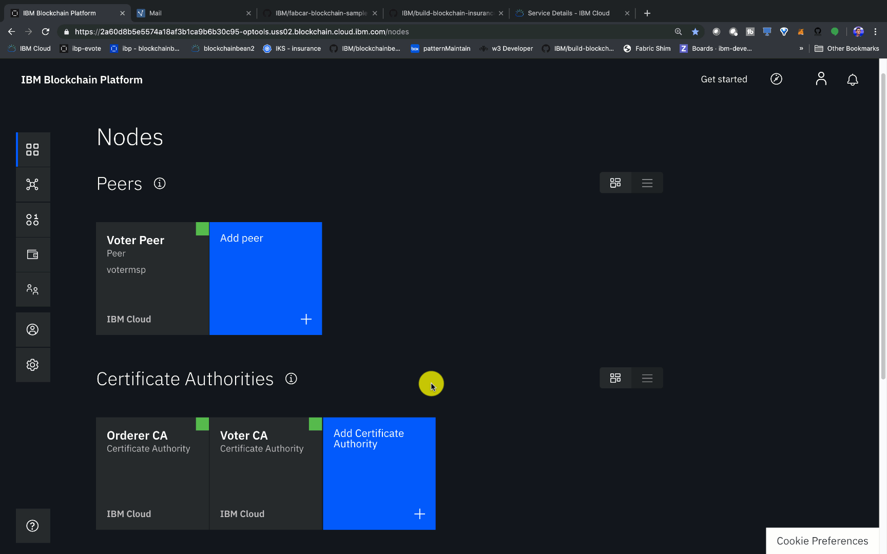
</p>
<br>


* #### Create the orderer organization MSP definition
  - Navigate to the <b>Organizations</b> tab in the left navigation and click <b>Create MSP definition +</b>.
  - Enter the <b>MSP display name</b> as `Orderer MSP` and the <b>MSP ID</b> as `orderermsp`. Click <b>Next</b>.
  - Specify `Orderer CA` as the <b>Root Certificate Authority</b>. Click <b>Next</b>.
  - Select the <b>New identity</b> tab. Give the <b>Enroll ID</b> and <b>Enroll secret</b> for your organization admin, i.e. `ordererAdmin` and `ordererAdminpw` respectively. Then, give the <b>Identity name</b> as `Orderer Admin`.
  - Click the <b>Generate</b> button to enroll this identity as the admin of your organization and add the identity to the wallet. Click <b>Export</b> to export the admin certificates to your file system. Click <b>Next</b>.
  - Review all the information and click <b>Create MSP definition</b>.

<br>
<p align="center">
  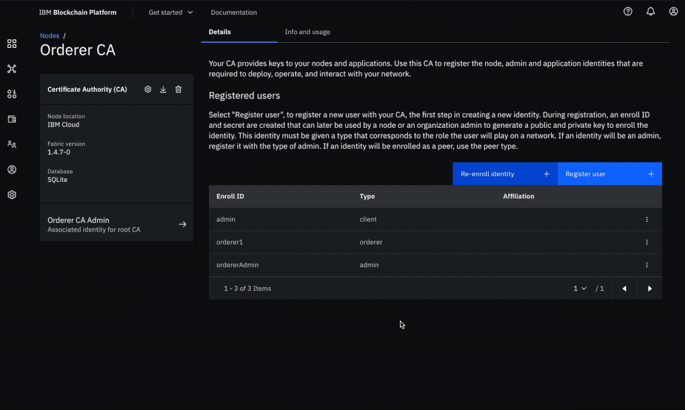
</p>
<br>


* #### Create an orderer
  - Navigate to the <b>Nodes</b> tab in the left navigation and click <b>Add ordering service +</b>.
  - Click <b>Create an ordering service +</b> and then click <b>Next</b>.
  - Give the <b>Ordering service display name</b> as `Orderer` and click <b>Next</b>.
  - On the next screen, select `Orderer CA` as the <b>Certificate Authority</b>. Then, give the <b>Ordering service enroll ID</b> and <b>Ordering service enroll secret</b> as `orderer1` and `orderer1pw` respectively. Select the <b>Organization MSP</b> as `Orderer MSP`. Leave the <b>TLS CSR hostname</b> blank and select `1.4.7-0` in the drop-down for <b>Fabric version</b>. Click <b>Next</b>.
  - Provide `Orderer Admin` as the <b>Orderer administrator identity</b> and click <b>Next</b>.
  - Review the summary and click <b>Add ordering service</b>.

<br>
<p align="center">
  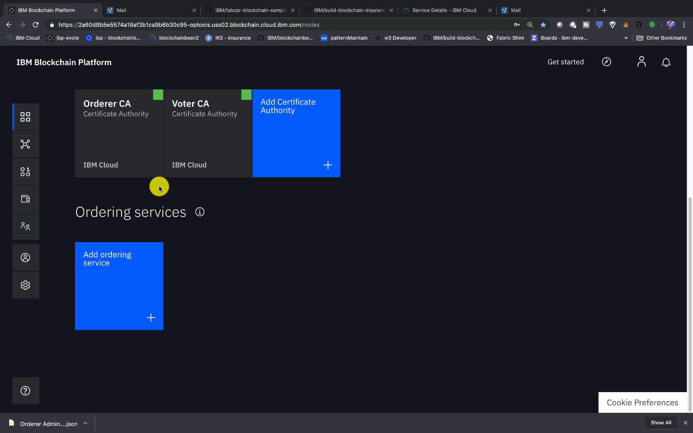
</p>
<br>

* #### Add organization as Consortium Member on the orderer to transact
  - Navigate to the <b>Nodes</b> tab, and click on the <b>Orderer</b> that was created.
  - Under <b>Consortium Members</b>, click <b>Add organization +</b>.
  - Select the <b>Existing MSP ID</b> tab. From the drop-down list, select `Voter MSP (votermsp)`, as this is the MSP that represents the peer's organization "Voter".
  - Click <b>Add organization</b>.

<br>
<p align="center">
  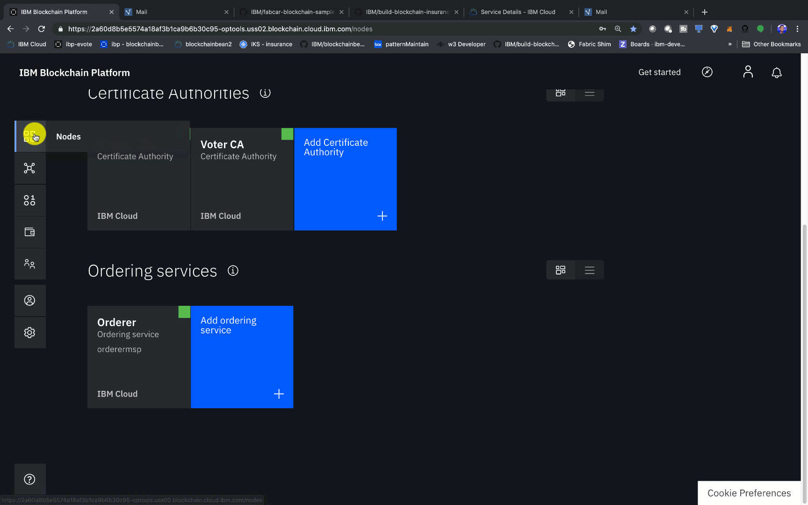
</p>
<br>


### Create and join channel

* #### Create the channel
  - Navigate to the <b>Channels</b> tab in the left navigation and click <b>Create channel +</b>.
  - Click <b>Next</b>.
  - Give the <b>Channel name</b> as `mychannel`. Select `Orderer` from the <b>Ordering service</b> drop-down list. Click <b>Next</b>.
  - Under <b>Organizations</b>, select `Voter MSP (votermsp)` from the drop-down list to add the organization "Voter" as a member of this channel. Click the <b>Add</b> button. Set the permissions for this member as <b>Operator</b>. Click <b>Next</b>.
  - Leave the <b>Policy</b> as the default value i.e. `1 out of 1`. Click <b>Next</b>.
  - Select the <b>Channel creator MSP</b> as `Voter MSP (votermsp)` and the <b>Identity</b> as `Voter Admin`. Click <b>Next</b>.
  - Review the summary and click <b>Create channel</b>.

<br>
<p align="center">
  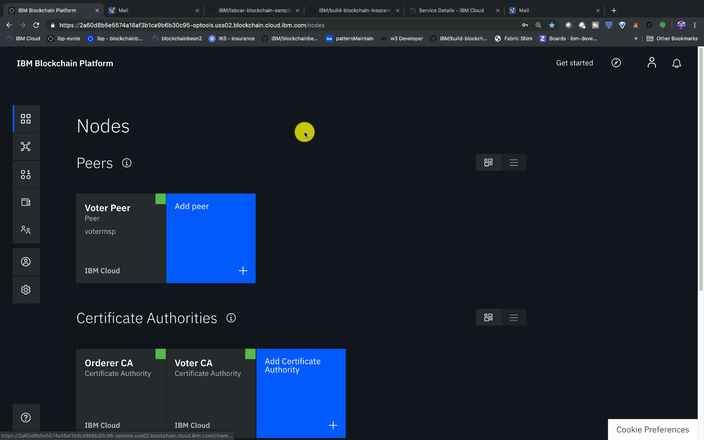
</p>
<br>


* #### Join your peer to the channel
  - Click on the newly created channel <b>mychannel</b>.
  - In the side panel that opens, under <b>Choose from available peers</b>, select `Voter Peer`. Once the peer is selected, a check mark will be displayed next to it. Ensure that <b>Make anchor peer(s)</b> is marked as `Yes`. Click <b>Join channel</b>.

<br>
<p align="center">
  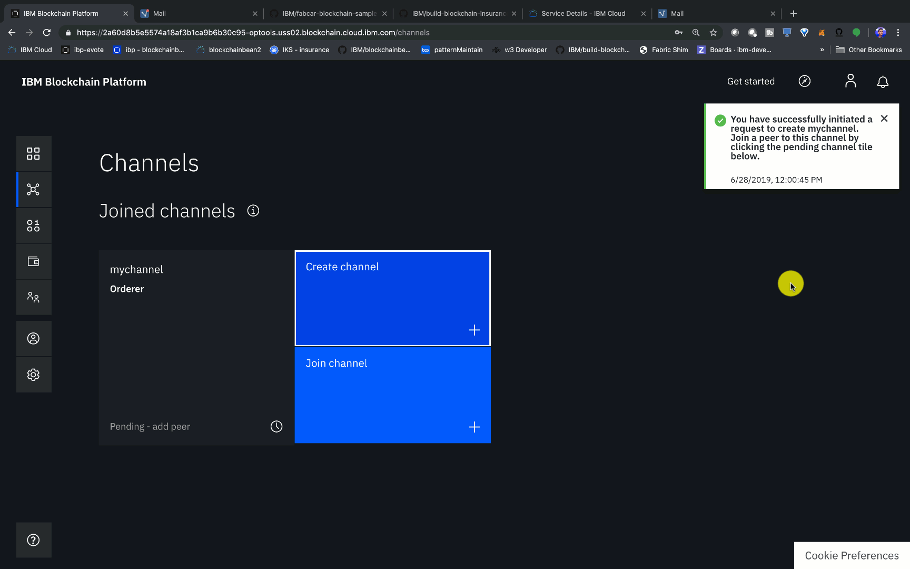
</p>
<br>


## Step 4. Deploy voterContract Smart Contract on the network

* #### Install a smart contract
  - Navigate to the <b>Smart contracts</b> tab in the left navigation and click <b>Install smart contract +</b>.
  - Click on <b>Add file</b>.
  - Browse to the location of the voterContract smart contract package file, which is in the root of the repo we cloned - the file is called `voterContract.cds`.
  - Once the contract is uploaded, click <b>Install smart contract</b>.

<br>
<p align="center">
  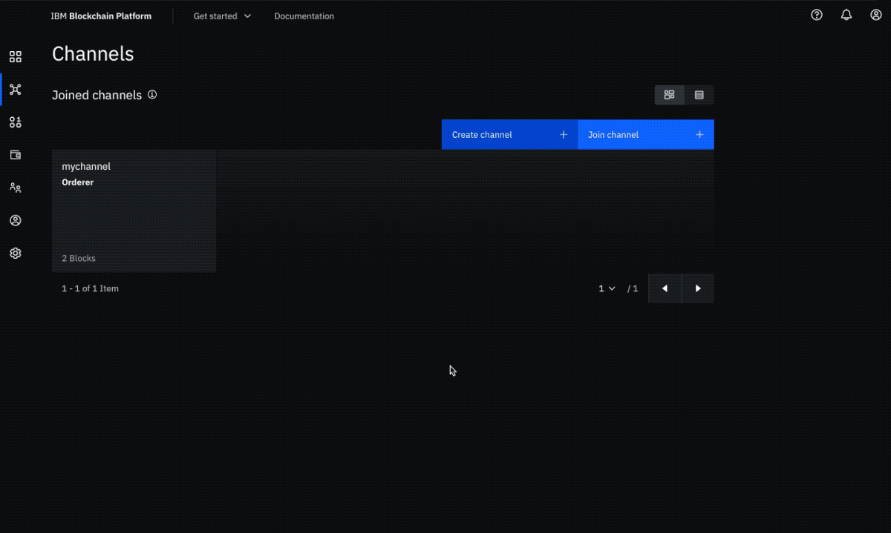
</p>
<br>


* #### Instantiate smart contract
  - Under <b>Installed smart contracts</b>, find the smart contract from the list (**Note: ours is called voterContract**) installed on our peer and click <b>Instantiate</b> from the overflow menu on the right side of the row.
  - On the side panel that opens, select the channel, `mychannel` on which to instantiate the smart contract. Click <b>Next</b>.
  - Select `Voter MSP` as the organization member to be included in the endorsement policy. Click <b>Next</b>.
  - Skip the <b>Setup private data collection</b> step and simply click <b>Next</b>.
  - Give the <b>Function name</b> as `init` and leave the <b>Arguments</b> blank. <b>Note: init is the method in the voterContract.js file that initiates the smart contracts on the peer.</b>
  - Click <b>Instantiate smart contract</b>.

<br>
<p align="center">
  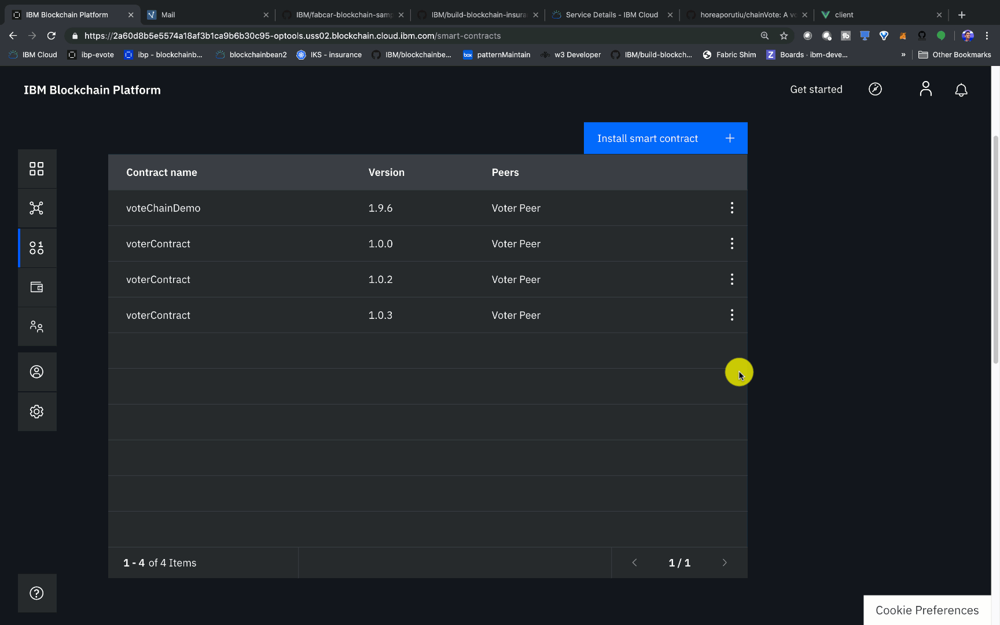
</p>
<br>


## Step 5. Connect application to the network

* #### Connect with sdk through connection profile
  - Navigate to the <b>Organizations</b> tab in the left navigation, and click on <b>Voter MSP</b>.
  - Click on <b>Download Connection Profile</b>. 
  - In the side panel that opens up, select `Yes` as the response for <b>Include Voter CA for user registration and enrollment?</b>. Under <b> Select peers to include</b>, select `Voter Peer`. Then click <b>Download connection profile</b>. This will download the connection json which we will use to establish a connection between the Node.js web application and the Blockchain Network.

<br>
<p align="center">
  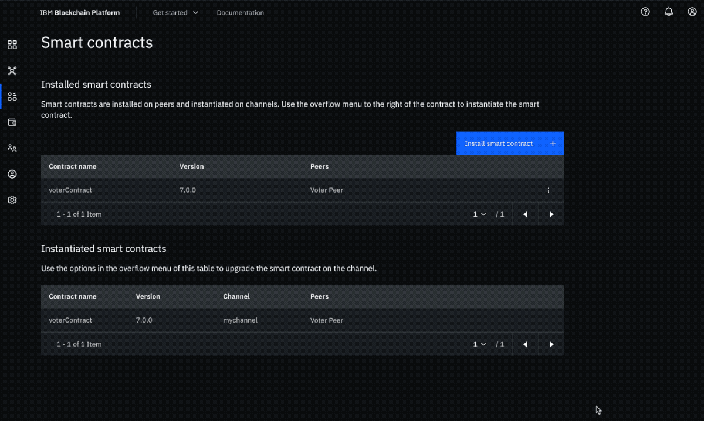
</p>
<br>


* #### Create an application admin
  - Navigate to the <b>Nodes</b> tab in the left navigation, and under <b>Certificate Authorities</b>, choose <b>Voter CA</b>.
  - Click on the <b>Register User +</b> button. Give an <b>Enroll ID</b> of `app-admin` and an <b>Enroll secret</b> of `app-adminpw`. Set the <b>Type</b> for this identity as `client`. Specify to <b>Use root affiliation</b>. Leave the <b>Maximum enrollments</b> field blank. Click <b>Next</b>.
  - Click on <b>Add attribute +</b>. Enter the <b>attribute name</b> as `hf.Registrar.Roles` and the <b>attribute value</b> as `*`. Click <b>Register user</b>.

<br>
<p align="center">
  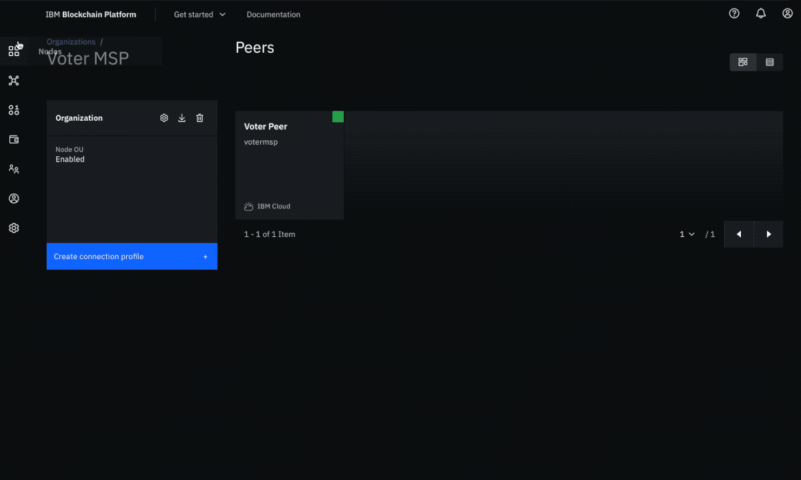
</p>
<br>


* #### Update application connection
  - Copy the connection profile you downloaded into [server folder](./web-app/server)
  - Rename the connection profile you downloaded **ibpConnection.json**
  - Update the [config.json](server/config.json) file with:
    - `ibpConnection.json`.
    - The <b>enroll id</b> and <b>enroll secret</b> for your app admin, which we earlier provided as `app-admin` and `app-adminpw`.
    - The orgMSP ID, which we provided as `votermsp`.
    - The caName, which can be found in your connection json file under "organizations" -> "votermsp" -> certificateAuthorities". This would be like an IP address and a port. You should also use the `https` version of the certificateAuthorities line.
    - The username you would like to register.
    - Update gateway discovery to `{ enabled: true, asLocalhost: false }` to connect to IBP.

<br>
<p align="center">
  
</p>
<br>

- Once you are done, the final version of the **config.json** should look something like this:

```js
{
    "connection_file": "ibpConnection.json",
    "appAdmin": "app-admin",
    "appAdminSecret": "app-adminpw",
    "orgMSPID": "votermsp",
    "caName": "https://173.193.106.28:32634",
    "userName": "V1",
    "gatewayDiscovery": { "enabled": true, "asLocalhost": false }
}
```


## Step 6. Run the application

* #### Enroll admin
  - First, navigate to the `web-app/server` directory, and install the node dependencies.
    ```bash
    cd web-app/server
    npm install
    ```
  
  - Run the `enrollAdmin.js` script
    ```bash
    node enrollAdmin.js
    ```

  - You should see the following in the terminal:
    ```bash
    msg: Successfully enrolled admin user app-admin and imported it into the wallet
    ```

  - Start the server:
    ```bash
    npm start
    ```

<br>
<p align="center">
  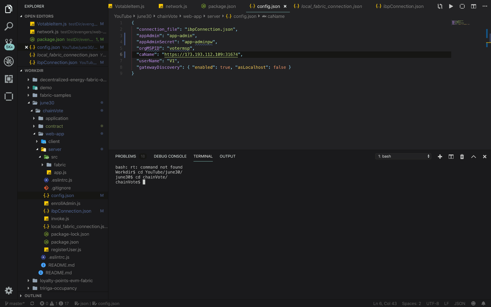
</p>
<br>

* #### Start the web client
  - In a new terminal, open the `web-app/client` folder from the root directory. 
  Install the required dependencies with `npm install`.
    ```bash
    cd web-app/client
    npm install
    ```

  - Start the client:
    ```bash
    npm run serve
    ```

  - In a browser of your choice, go to http://localhost:8080/#/.  If all goes well, you should see 
  something like the gif below:

<br>
<p align="center">
  
</p>
<br>

You can find the app running at http://localhost:8080/  If all goes well, you should be greeted 
with the homepage that says <b>2020 Presidential Election</b>

Now, we can start interacting with the app.

First, we need to register as a voter, and create our digital identity with 
which we will submit our vote with. To do this, we will need to enter 
a uniqueId (drivers license) with a registrarId, and our first and last names.
After we do that, and click `register` the world state will be updated with 
our voterId and our name and registrarId.

If all goes well, you should see `voter with voterId {} is updated in the world state. Use voterId to login above.`
<b>Note: on the first try, the app can take a second to start up. If you click on `register` and nothing 
happens, try to fill in the form and click register again!</b>

Next, we can login to the app with our voterId.

Once we login, we can cast our vote. We will use our voterId again to cast our 
vote. Since we are voting for the presidential
election for 2020, we can choose the party of our liking. Once we are done, we
can choose submit, and then our vote is cast. As long as this voterId hasn't 
voted before, all is well. Next, we can view the poll standings by clicking
`Get Poll Standings` and clicking `Check Poll`. This will query the world 
state and get the current number of votes for each political party.

<br>
<p align="center">
  
</p>
<br>

If we want to query for a particular voterId, we can do so in the `Query by Key` tab.
If we want to query by object, we can do so by clicking on the `Query by Type` 
tab, and entering a type, such as `voter`. This will return all voter objects 
that are currently in the state. `QueryAll` will return all objects in the state.

<br>
<p align="center">
  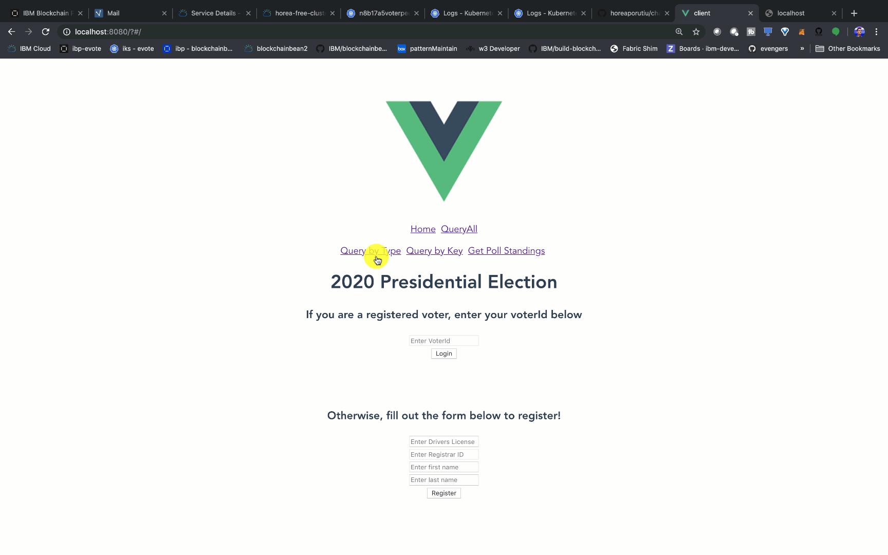
</p>
<br>


## Extending the code pattern
Pull requests and contribution are always welcome. Remember that a code pattern is a path to a solution, 
and not a complete solution on its own. To make this a more complete solution,
this application can be expanded in a couple of ways:

  * Use an API to verify the drivers license to make sure it is valid, and registered with the DMV.
  * Use a more complex consensus mechanism where multiple organizations (DMV, US Federal Government, US State
  Government) have to approve a vote before it is successfully recorded onto the blockchain.
  * Use ordering service which uses Raft consensus mechanism.


## Troubleshooting

* If you get an error that says `Error: Calling register endpoint failed with error [Error: self signed certificate]`, you can get past this by adding `"httpOptions": {"verify": false}` to the certificateAuthorities section of the connection profile that was downloaded from IBM Blockchain Platform.

<br>
<p align="center">
  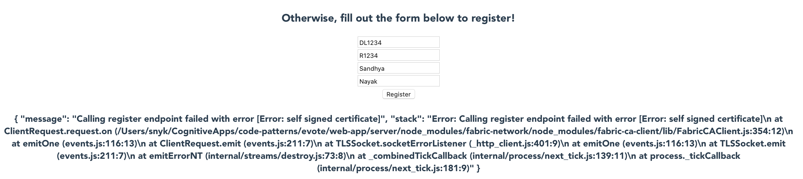
</p>
<br>

<br>
<p align="center">
  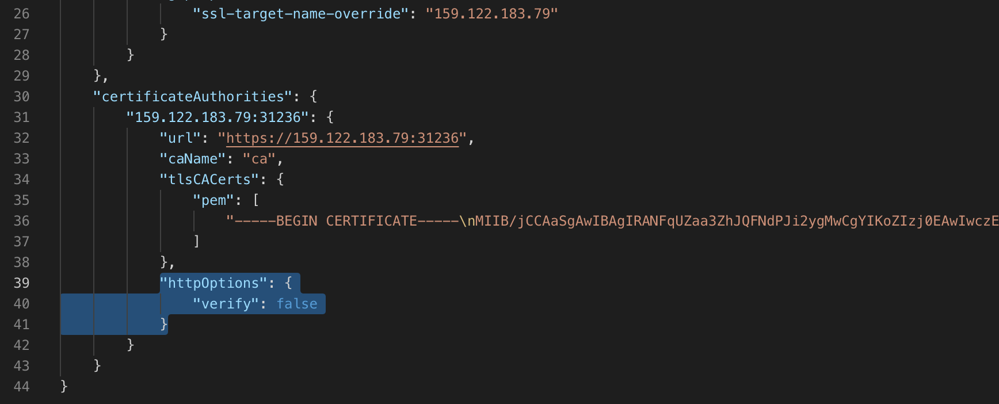
</p>
<br>


## Related Links
* [Hyperledger Fabric Docs](http://hyperledger-fabric.readthedocs.io/en/latest/)
* [IBM Code Patterns for Blockchain](https://developer.ibm.com/patterns/category/blockchain/)


## License
This code pattern is licensed under the Apache Software License, Version 2. Separate third-party code objects invoked within this code pattern are licensed by their respective providers pursuant to their own separate licenses. Contributions are subject to the [Developer Certificate of Origin, Version 1.1 (DCO)](https://developercertificate.org/) and the [Apache Software License, Version 2](https://www.apache.org/licenses/LICENSE-2.0.txt).

[Apache Software License (ASL) FAQ](https://www.apache.org/foundation/license-faq.html#WhatDoesItMEAN)

