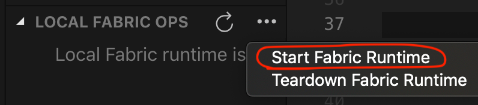
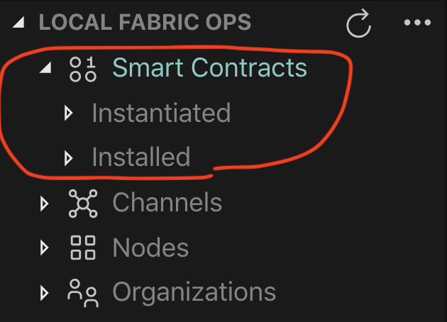
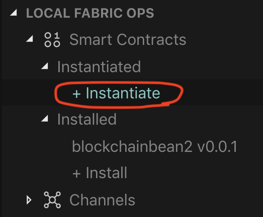
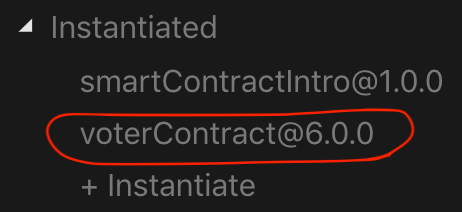

<!-- [](https://travis-ci.org/IBM/blockchainbean) -->

# Create a fair evoting application to ensure correct election results with Hyperledger Fabric and IBM Blockchain Platform (Local)

# Steps (Local Deployment)

1. [Clone the Repo](#step-1-clone-the-repo)
2. [Install Dependencies](#step-2-install-dependencies)
3. [Install Contract](#step-4-install-contract)
4. [Instantiate Contract](#step-5-Instantiate-contract)
5. [Submit Transactions](#step-6-submit-transactions)

Note: This repo assumes you have [VSCode](https://code.visualstudio.com/download) 
and [IBM Blockchain VSCode extension](https://marketplace.visualstudio.com/items?itemName=IBMBlockchain.ibm-blockchain-platform) installed. If you don't, first install the 
latest version of VSCode, and then install the IBM Blockchain VSCode extension ensuring you 
have the correct [system requirements](https://marketplace.visualstudio.com/items?itemName=IBMBlockchain.ibm-blockchain-platform) to run the extension. You will need Docker as 
this is how the extension builds a development Hyperledger Fabric network with a click of a button.

## Step 1. Clone the Repo

Git clone this repo onto your computer in the destination of your choice, then go into the web-app folder:
```
HoreaPorutiu$ git clone https://github.com/IBM/evote
```

## Step 2. Install Dependencies

Navigate to the `web-app/server` directory:

Install required dependencies using NPM:
```
web-app$ npm install --ignore-scripts
```

## Step 3. Start the Fabric Runtime
- First, we need to go to our IBM Blockchain Extension. Click on the IBM Blockchain icon
  in the left side of VSCode (It looks like a square). 
- Next, start your local fabric by clicking on the 
  *three dot symbol* to the right of *LOCAL FABRIC OPS*
  and then *Start Fabric Runtime*.
  <p align="center">
    
  </p>
  
- Once the runtime is finished starting (this might take a couple of minutes), under *Local Fabric 
  Ops* you should see *Smart Contracts* and a section for both *installed* and *instantiated*.

  <p align="center">
    
  </p>


## Step 4. Install Contract

 Now, let's click on *+ Install* and choose the peer that is available. Then the extension will ask you which package to 
 install. Choose *voterContract@6.0.0* which is in your `evote/contract` directory which you just
 
  If all goes well, you should get a notification as shown 
 below.


## Step 5. Instantiate Contract
You guessed it. Next, it's time to instantiate. 
 
  Click on *+ Instantiate* 

<p align="center">
  
</p>

and then choose 
 *mychannel* for the channel to instantiate the contract on.


Next, the extension will ask you 
 to choose a smart contract and version to instantiate. Click on *voterContract@6.0.0*.

 Next, for the optional function, type in *init*.


Leave the arguments blank, and hit *enter* 
 on your keyboard. 


 This will instantiate the smart contract. You should see the contract 
 under the *instantiated* tab on the left-hand side, as shown in the picture. 

<p align="center">
  
</p>

## Step 5. Export Connection Details

- Under *LOCAL FABRIC OPS* and Nodes, right-click on `peer0.org1.example.com` and select
  *Export Connection Profile* and then choose the `evote/web-app/server` directory. Next,
  update the `config.json` file so it looks like this:

```json
{
  "connection_file": "local_fabric_connection.json",
  "appAdmin": "admin",
  "appAdminSecret": "adminpw",
  "orgMSPID": "Org1MSP",
  "caName": "ca.org1.example.com",
  "userName": "V1",
  "gatewayDiscovery": { "enabled": true, "asLocalhost": true }
}
```

#### Start the Server
  - First, navigate to the `server` directory, and install the node dependencies.
    ```bash
    cd server
    npm install
    ```
  - Then, start the server: 
    ```bash
    npm start
    ```
  - If all goes well, you should see the following in your terminal:
  ```
    > server@1.0.0 start /Users/Horea.Porutiu@ibm.com/Workdir/testDir/July7/evote/web-app/server
    > ./node_modules/nodemon/bin/nodemon.js src/app.js

    [nodemon] 1.19.1
    [nodemon] to restart at any time, enter `rs`
    [nodemon] watching: *.*
    [nodemon] starting `node src/app.js`  
  ```

#### Start the Front-end (Client)

- First, navigate to the `client` directory, and install the node dependencies.
    ```bash
    cd evote/web-app/client
    npm install
    ```
  - Then, start the client: 
    ```bash
    npm run serve
    ```
  - If all goes well, you should see the following in your terminal:
  ```
     DONE  Compiled successfully in 6803ms                                                                                             11:48:20
 
      App running at:
      - Local:   http://localhost:8080/ 
      - Network: unavailable

      Note that the development build is not optimized.
      To create a production build, run npm run build. 
  ```


 Nice. We're pretty much ready to submit transactions on our contract. Go to http://localhost:8080/ 
 to see your app.

 Go ahead and register a voter, login with your VoterId, and submit a vote. Have fun! :) 

 <br>
<p align="center">
  
</p>
<br>