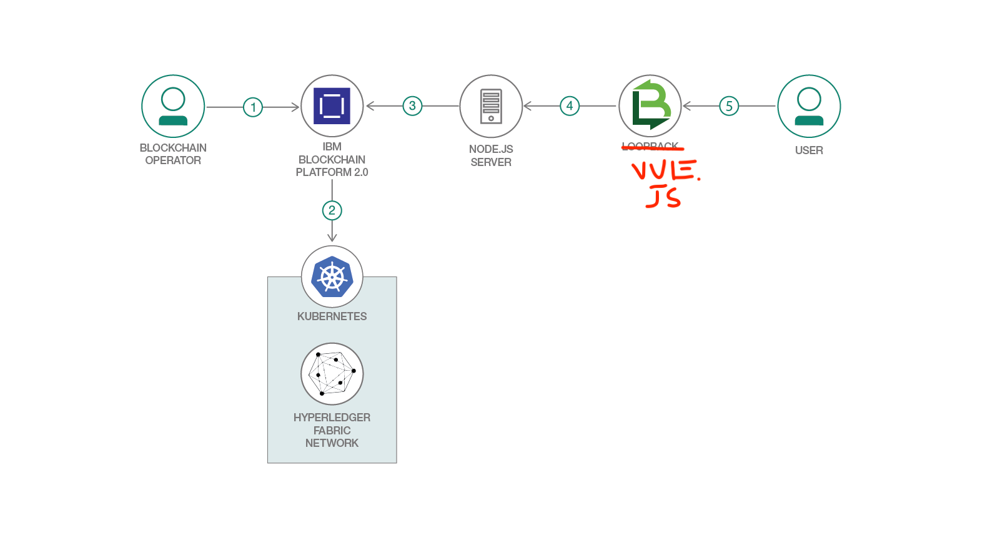

> Use this file to gather the content required for the pattern overview. Copy this draft-patten-template.md file, replace with your own content for each of the sections below, and attach your file to the GitHub tracking issue for your pattern.

> For full details on requirements for each section, see "Write a code pattern overview" on w3 Developer: [https://w3.ibm.com/developer/documentation/write-code-pattern-overview/](https://w3.ibm.com/developer/documentation/write-code-pattern-overview/)

# Short title

> Build a secure evoting app

# Long title

> Expand on the short title, focusing on open source or generic tools and programs. Include IBM product names only if that product is required in the pattern and cannot be substituted.

Build a web-based blockchain evoting app using IBM Blockchain Platform and IBM Kubernetes Service 

# Author

* Horea Porutiu <horea.porutiu@ibm.com>

# URLs

### Github repo

> https://github.com/horeaporutiu/chainVote

### Other URLs

* Demo URL (Intro) - https://www.youtube.com/watch?v=ny8iif6ZXRU
* Demo URL (Run app) - https://www.youtube.com/watch?v=mkVUW1KroTI

* Code walkthrough URL (User Auth) - https://www.youtube.com/watch?v=8uJSHW3Rpzs
* Code walkthrough URL (Routes)- https://www.youtube.com/watch?v=iajsJiIC7oU

# Summary

> With its distributed ledger, smart contracts, and non-repudiation capabilities, blockchain is revolutionizing the way organizations do business, and the election industry is no exception. This code pattern shows you how to implement a web-based blockchain app using the IBM Blockchain Platform to facilitate voting and ensure the prevention of double-voting.

# Technologies

* [Hyperledger Fabric v1.4](https://hyperledger-fabric.readthedocs.io/en/release-1.4/): A platform for distributed ledger solutions, underpinned by a modular architecture that delivers high degrees of confidentiality, resiliency, flexibility, and scalability.

[Node.js](https://nodejs.org/en/):An open source, cross-platform JavaScript run-time environment that executes server-side JavaScript code.

# Description
Have you ever wondered how exactly the votes in a presidential election counted? What if instead of having volunteers that are spending hours a day counting votes manually, we have an app that was backed by blockchain, recording each vote made by a voter, ensuring double-voting is not possible? That's what this code pattern explains how to do. We aim to build a web-app in which the voter can register with their drivers license, get a unique voterId which is used to login to the app, and cast the vote. The vote is tallied on the blockchain, and the web-app shows the current standings of the polls.

At the start of the application, the user registers to vote by providing their drivers license number,
registrar district, and first and last name. In this step, we can check to see if the drivers license 
is valid, and has not been registered previously. If all goes well, we create a private and public key 
for the voter with our certificate authority that is running on the cloud, and add those keys to the 
wallet. 

After that, we use our drivers license number to submit our vote, during which the application checks 
if this drivers license number has voted before and tells the user they have already submitted a vote 
if so. If all goes well, the political party which the voter has chosen is added a vote, and the world
state is updated. The application then updates our current standings of the election to show which 
political party the user has voted for. 

Since each transaction that is submitted to the ordering service must have a signature from a valid
public-private key pair, we can trace back each transaction to a registered voter of the application, 
in the case of an audit.

In conclusion, although this is a simple application, the developer can see how they can implement a 
Hyperledger Fabric web-app to decrease the chance of election-meddling, and enhance a voting application
by using blockchain technology. 

# Flow

 

  

 

# Flow Description
1. The blockchain operator sets up the IBM Blockchain Platform 2.0 service.
2. The IBM Blockchain Platform 2.0 creates a Hyperledger Fabric network on an IBM Kubernetes 
Service, and the operator installs and instantiates the smart contract on the network.
3. The Node.js application server uses the Fabric SDK to interact with the deployed network on IBM Blockchain Platform 2.0 and creates APIs for a web client.
4. The Vue.js client uses the Node.js application API to interact with the network.
5. The user interacts with the Vue.js web interface to cast their ballot and
and query the world state to see current poll standings.

# Instructions

> Find the detailed steps for this pattern in the [readme file](https://github.com/horeaporutiu/chainVote/blob/master/README.md#steps-cloud-deployment). The steps will show you how to:

1. [Clone the Repo](#step-1-clone-the-repo)
2. [Create IBM Cloud services](#step-2-create-ibm-cloud-services)
3. [Build a network](#step-3-build-a-network)
4. [Deploy voterContract Smart Contract on the network](#step-4-deploy-voterContract-smart-contract-on-the-network)
5. [Connect application to the network](#step-5-connect-application-to-the-network)
6. [Run the application](#step-6-run-the-application)

# Components and services

[IBM Cloud Kubernetes Service](https://cloud.ibm.com/catalog/infrastructure/containers-kubernetes)

[Blockchain Platform 2.0](https://cloud.ibm.com/catalog/services/blockchain-platform-20)

# Runtimes

* Node.js

# Related IBM Developer content
* [Create a basic blockchain network using Blockchain Platform V2.0](https://developer.ibm.com/patterns/build-a-blockchain-network/): Package blockchain smart contracts, set up a Hyperledger Fabric network, and execute a Node.js app with the Hyperledger Fabric SDK to interact with the deployed network.
* [Create a fair trade supply chain network](https://developer.ibm.com/patterns/coffee-supply-chain-network-hyperledger-fabric-blockchain-2/): Use Hyperledger Fabric and IBM Blockchain Platform 2.0 to increase efficiency in the supply chain of a coffee retailer.

# Related links
* [Hyperledger Fabric Docs](https://hyperledger-fabric.readthedocs.io/en/release-1.4/): Enterprise grade permissioned distributed ledger platform that offers modularity and versatility for a broad set of industry use cases.

